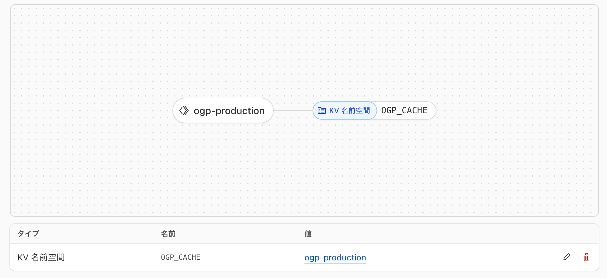

<samp>
<p align="center">
</p>

<h1 align="center">ogp</h1>

<!-- Badge -->
<p align="center">
<a href="https://github.com/nw-union/ogp/actions/workflows/push_main.yml"></a>
<a href="https://discord.com/channels/805068364476973076/1281497540830822473"></a>
</p>

<!-- About this Project -->
<p align="center">
外部サイトの OGP の情報を取得する API を提供するアプリケーション
</p>
<br />

## 🌏 URL

| Name       | URL                      |
| :--------- | :----------------------- |
| Production | https://ogp.nw-union.net |
| Local      | http://localhost:5173    |

<br />

## 🤝 How to Use

```bash
$ curl -s 'https://ogp.nw-union.net/api?url=https://nw-union.net'

{
  "domain": "nw-union.net",
  "url": "https://nw-union.net/",
  "icon": "https://nw-union.net/favicon.ico",
  "og": {
    "title": "NWU",
    "siteName": "NWU",
    "description": "We are Hangout crew. Lovers of Culture, Art and Tech!",
    "image": "https://nw-union.net/img/icon_196.png"
  },
  "twitter": {
    "card": "summary",
    "title": "NWU",
    "description": "We are Hangout crew. Lovers of Culture, Art and Tech!",
    "image": "https://nw-union.net/img/icon_196.png"
  }
}
```

<br />

## 🔰 Getting Started

### ローカルサーバー起動方法

0. 最新バージョンの [Bun](https://bun.com/) が動く環境であること
1. 依存パッケージ取得

```bash
bun install --frozen-lockfile
```

2. 開発サーバー起動

```
bun run dev
```

🏃 http://localhost:5173

<br/>

## 🏗️ Build

```
bun run build
```

<br/>

## 🚀　Infrastructure

アプリケーションは、nw-union の Cloudflare Workers で動いています。



main ブランチにマージされると、GitHub Actions により、デプロイされます。

<br/>
<br/>

--

Happy hacking 💛
</samp>
